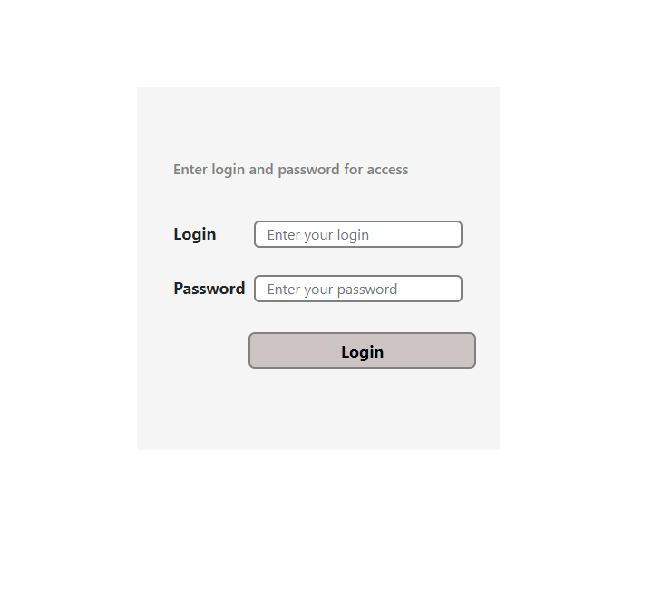
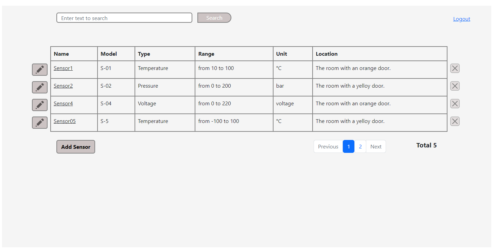
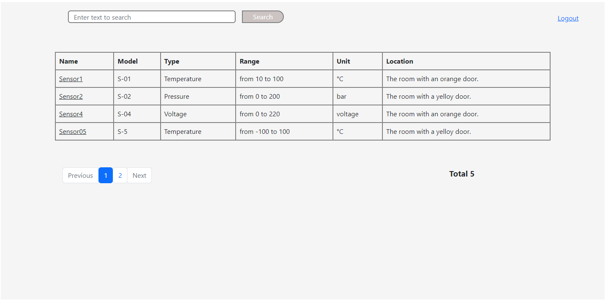
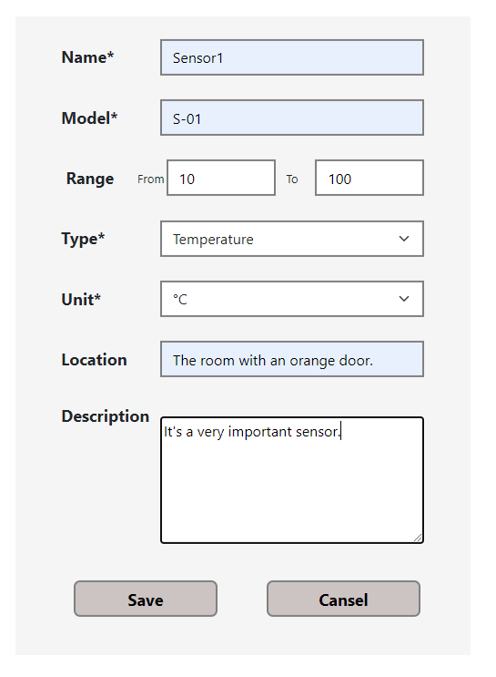

Angular sensor monitor application

This application is frontend part of sensor monitor web application.

This application has two access level: viewer and administrator.

Authorized users can get access to sensors data. Viewers can read data only, an administrator can modify sensors data, remove and add sensors.

To start this application you need:
- pull this project to your repository;
- open terminal and follow to the folder with the project;
- run the command 'npm install';
- run the command 'npm run start'.

This application runs on the http://localhost:4200 and sends requests to backend that has to be run on the http://localhost:8088.

This application includes three forms:

- Login form:

- Sensors data(admin):

- Sensors data(user):

- Save-edit sensor form:
